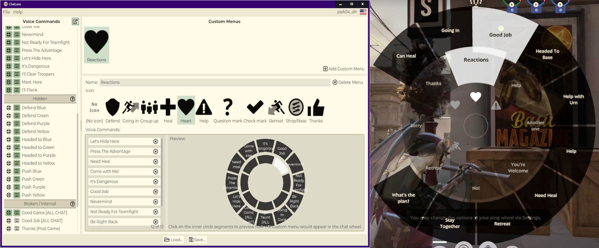
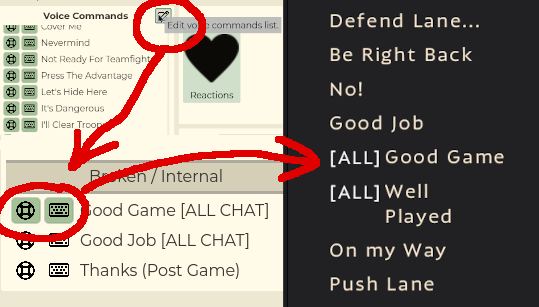

# ChatLane

A tool to customize the chat wheel of Valve's game Deadlock:

- Create custom chat wheel menus. Name, icon and contents can be customized.
- Unlock voice commands that are normally not bindable.
- One click to generate an add-on VPK file, ready for use in the game.
- Share configs with your friends or online! You can directly load the VPKs, without needing to extract.
- Graphical interface for easy use, as well as a command-line tool for nerds.



## Disclaimer

- Deadlock is in early alpha, so this tool and add-on **may stop working at any moment**.
- As the tool edits a game file (specifically a script file), I am **not responsible for any bans for users of this tool**. Valve does not have a clear stance on what's fair game when it comes to modding Deadlock yet!

## Installation and Usage

To get ChatLane, download the [latest release's](https://github.com/redmser/chatlane/releases) zip archive.

Extract everything somewhere, then run the `ChatLane-GUI.exe` file.


On the left, you have an overview of all voice commands in the game.
Those with a checkmark are hidden by default, for various reasons (see the corresponding headers in the list for more info).
You can enable them so that they show up in the "Chat Wheel" settings of Deadlock as additional options.



On the right you can define custom menus.
Create a new menu, give it a name and icon, then you can decide what voice lines should be inside.
Use drag and drop from the left list onto the right box to assign voice lines to the menu. You can also use drag and drop to re-arrange the elements inside the list.
When in-game, you will see the new custom menus you've created at the bottom of the "Chat Wheel" settings.


In order to be able to see your changes, you must set up your Deadlock for modding.

<details>
<summary>Click here to learn how to install add-ons for Deadlock.</summary>

- Open the game folder (right-click on the game in Steam -> Manage -> Browse local files).
- Go to `game/citadel` and open `gameinfo.gi` in a text editor.
- Near the top of the file should be a block called `SearchPaths`. Replace it so that it looks like this:

```
SearchPaths
{
  Game                citadel/addons
  Mod                 citadel
  Write               citadel
  Game                citadel
  Write               core
  Mod                 core
  Game                core
}
```

Note that you will have to do this step every time a major patch for the game comes out.

- Still in the `game/citadel` folder, create a new folder called `addons` (if it does not exist yet).

You can now install add-ons for Deadlock by placing `pakXX_dir.vpk` files into the `addons` folder.
The `XX` numbers usually don't matter, as long as you start with `02` and keep counting up for each new add-on you install.

</details>

Once done, ChatLane can directly save `pakXX_dir.vpk` files without any intermediate steps! Just place it in the `addons` folder and you're done.


Open the game's settings and go to the Chat Wheel tab. This should now feature your new custom menus at the bottom, as well as any hidden voice commands you've decided to enable.

If you later want to edit your config, you can simply load the VPK file again, do your changes, then save and overwrite it.

To uninstall the add-on, you can rename or delete the VPK file. You **MUST** also enter the chat wheel settings and **unbind** any custom entries! Failing to do so will cause the game to **crash** when opening the chat wheel.

## Known bugs and limitations

Entries in this list can not be fixed easily, due to how the chat wheel system of Deadlock works. The list will be updated as Valve fixes them.

- If you removed a custom menu (or uninstalled the add-on), you have to manually unbind the "blank" entries in the game's chat wheel settings. Otherwise, opening the chat wheel will crash your game!
- A custom menu can have up to 12 entries, filling up the entire circle.
- Having multiple menus on the wheel causes the menu to show incorrect contents.
- Menus sometimes open in the wrong direction, making them unusable. Simply bind them to another direction.
- A placeholder voice line plays when you select a custom menu (when not selecting one of its entries).

For any other bugs, it's either an issue with ChatLane, or a new game update broke the add-on. In either case, feel free to open an issue so that we can figure it out!

# Technical info

Read on for all those developers, contributors and reverse-engineers among you.

## Repository structure

- `CLI`: A bridge that converts between a human-readable interchange YAML config format, and a fully bundled VPK add-on which can be loaded as-is into Deadlock.
- `GUI`: A layer on top of the CLI which allows for graphical modification of the config.
- `tools`: Scripts for building and deploying.

## Building

Only Windows builds are supported, since that is all I currently have access to.
Contributions are welcome, and I will try my best to help with any issues encountered!

The script `tools/prepare_build.ps1` prepares all projects and builds them in the same way as the release zip archives.

You currently need to do some changes by hand to get it working. See [this issue](https://github.com/RedMser/chatlane/issues/11) for a list of tweaks you must do.

### CLI

In the project root folder, run `dotnet publish CLI`

### GUI

A custom Godot 4.4 build was used for the GUI. It relies on [this pending PR](https://github.com/godotengine/godot/pull/77907) as well as some minor bug fixes [[1]](https://github.com/godotengine/godot/pull/99223)[[2]](https://github.com/godotengine/godot/pull/99266).
When using [official 4.4 builds](https://godotengine.org/download/preview/), you may be able to circumvent the errors caused by the unmerged PR by replacing `tmp://` paths in the project.

Additionally, a build profile was used to reduce the export template file size slightly:

```
scons target=template_release build_profile="GUI/GUIdot.build"
```

This custom build is not required to run the project.

## Third-Party

- [ValveResourceFormat](https://github.com/ValveResourceFormat/ValveResourceFormat) (MIT) for the very helpful Source 2 Viewer and KV3 library
- [ValvePak](https://github.com/ValveResourceFormat/ValvePak) (MIT) for VPK library
- [SourceIO](https://github.com/REDxEYE/SourceIO) (MIT) for binary KV3 writer
- [Godot Engine](https://github.com/godotengine/godot) (MIT) for being a great cross-platform GUI toolkit
- [YamlDotNet](https://github.com/aaubry/YamlDotNet) (MIT) and [godot_rust_yaml](https://github.com/ynot01/godot_rust_yaml) (Apache 2.0) for YAML support
- [FontAwesome Free](https://fontawesome.com/) (CC-BY 4.0) for some icons in the GUI
- [Montserrat](https://fonts.google.com/specimen/Montserrat) (OFL) font
- Deadlock Modding Discord for CSDK
- 9joao6 for the ChatLane logo
- Valve for Deadlock
